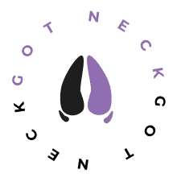

# Gotneck

Protótipo de sistema destinado ao gerenciamento de animais presentes no setor da caprino cultura da EAJ/UFRN para as disciplinas de Programação Visual e Autoria Web e Vertentes Produtivas nas Ciências Agrárias

    

